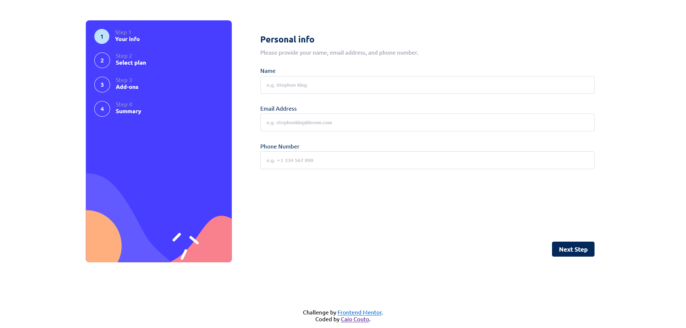

<h3 align="center">Frontend Mentor</h3>
<h1 align="center">Multi-step form</h1>

**pt.** Esta é uma solução para o [Desafio Multi-step Form do Frontend Mentor](https://www.frontendmentor.io/challenges/multistep-form-YVAnSdqQBJ).

**en.** This is a solution to the [Multi-step form challenge on Frontend Mentor](https://www.frontendmentor.io/challenges/multistep-form-YVAnSdqQBJ).

## Table of contents

- [Overview](#overview)
  - [The challenge](#the-challenge)
  - [Screenshot](#screenshot)
  - [Links](#links)
  - [Built with](#built-with)
- [Author](#author)

## Overview

### The challenge

**pt.** O desafio era codificar uma formulário de múltilos estágios o mais parecido possível com os designs fornecidos.

Os usuários devem ser capazes de:
- Completar cada um dos estágios
- Voltar para um estágio anterior e atualizar a sua decisão
- Ver um resumo das seleções no estágio final e confimar o seu pedido
- Ver o *layout* de forma otimizada para a sua tela
- Receber mensagens de validação se:
  - Um campo não foi preenchido
  - O endereço de email está formatado da forma correta
  - Nenhuma seleção foi feita no estágio atual

**en.** The challenge was to build out this multi-step form and get it looking as close to the design as possible.

Users should be able to:

- Complete each step of the sequence
- Go back to a previous step to update their selections
- See a summary of their selections on the final step and confirm their order
- View the optimal layout for the interface depending on their device's screen size
- See hover and focus states for all interactive elements on the page
- Receive form validation messages if:
  - A field has been missed
  - The email address is not formatted correctly
  - A step is submitted, but no selection has been made

### Links

- [GitHub Pages](https://caiocouto.github.io/multi-step-form-frontend-mentor/) (not yet)
- [Vercel](https://multi-step-form-frontend-mentor.vercel.app/) (not yet)

### Built with

**pt.**
- HTML5 semântico
- CSS Grid e Flexbox
- Mobile first

**en.**
- Semantic HTML5 markup
- CSS Grid and Flexbox
- Mobile-first workflow

## Author

- Frontend Mentor - [@CaioCouto](https://www.frontendmentor.io/profile/CaioCouto)
